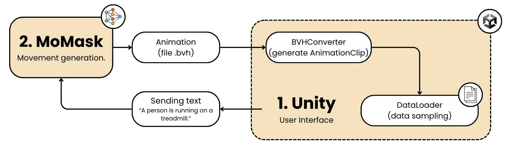

# HumanoidMotionPrep

This repository is part of a larger project providing a set of tools for **parsing, converting, and visualizing `.bvh` files** within **Unity**. It is designed to handle humanoid motion data generated by the text-to-motion model [MoMask](https://github.com/EricGuo5513/momask-codes), which produces animations from textual prompts. These tools are intended to support the training of virtual humanoid agents using **Deep Reinforcement Learning**. The diagram below shows the overall workflow of the repository.

  
*Figure: System architecture. The user enters a textual prompt in Unity, which is sent to the MoMask model for motion generation. The resulting `.bvh` animation file is converted into an `AnimationClip` in Unity, then sampled to extract motion information for training agents.*

---

## ✨ Key Objectives

- Integrate external AI models (e.g., [MoMask](https://github.com/EricGuo5513/momask-codes)) to generate motion from text prompts.
- Convert `.bvh` files into Unity-compatible `AnimationClip`s using parsing code adapted from [emilianavt's BVHTools](https://github.com/emilianavt/BVHTools).
- Visualize and validate animation data on humanoid models.
- Provide tools for debugging and structural visualization of motion data.

---

## 🗂 Project Structure

### 🤖 `MoMaskUnityBridge`

This module handles **integration with MoMask**, a text-to-motion generator, and converts the generated animation into a Unity `AnimationClip`.

- `PythonCommandRunner.cs`: Builds and executes Python commands for motion generation.
- `RunPythonCommandEditor.cs`: Unity editor interface for running MoMask and converting output.

📄 Detailed documentation available in [`/MoMaskUnityBridge/README.md`](HumanoidMotionPrep/Assets/Editor/MoMaskUnityBridge/README.md)

---

### 🔁 `BVHConverter`

Responsible for **converting `.bvh` files into `AnimationClip`s**, with support for structured directories.

- `BVH2ClipEditor.cs`: Unity Editor GUI to select `.bvh` folders and start the conversion.
- `BVHConverter.cs`: Core logic for parsing and generating rotation/position curves.
- `BVHParser`: Supporting class that interprets raw `.bvh` data.

📄 Detailed documentation available in [`/Editor/BVHConverter/README.md`](HumanoidMotionPrep/Assets/Editor/BVH2Clip/README.md)

---

### 🧪 `DebugDataVisualization`

Tools for **visualizing and validating animations** inside Unity.

- `SkeletonMapper.cs`: Maps model `Transform`s to logical joint names.
- `PlayAnimationOnHumanoid.cs`: Plays animation frame-by-frame on a humanoid model.
- `DrawHumanoidSkeletonGizmos.cs`: Uses Gizmos to draw skeletal structure for debugging.

📄 Detailed documentation available in [`/HumanoidAgent/Editor_DebugDataVisualization/README.md`](HumanoidMotionPrep/Assets/Script/HumanoidAgent/Editor_DebugDataVisualization/README.md)

---

## 🧠 AI Integration

The generated and visualized data can be used to train virtual agents in Unity using **ML-Agents** and **Deep Reinforcement Learning**. The system is designed to bridge raw motion data and AI training pipelines.

---

## ⚙️ Requirements

- Unity 2021.3 or later.
- Python 3.10 (for MoMask integration).
- A working environment with `ml-agents`, `torch`, and MoMask dependencies installed.

---

## 🚀 Quick Start

1. Install MoMask [MoMask](https://github.com/EricGuo5513/momask-codes)
2. Go to `Editor\MoMaskUnityBridge\RunPythonCommandEditor.cs` and set your *pythonPath*
3. Open Unity and go to `Tools > MoMask` to generate animations from text prompts.
4. Load the **ViewAnimationData** scene from the `Scenes` folder.
5. In the **HumanoidCloningManager** component, set the `animationName` field to the name of the animation generated by MoMask (located in `Animations/YourAnimationName`).

---

## 📌 Notes

- You must install the pre-trained [MoMask](https://github.com/EricGuo5513/momask-codes) model before using this toolchain.
- Some folders (e.g., `DebugDataVisualization`) are meant for editor use only and can be excluded from builds.
- You can combine all modules into a full pipeline: text generation (MoMask) → parsing (BVHConverter) → visualization → agent training.

---

## 👤 Author

Developed by **Gian Marco Lelli** as part of a thesis project on virtual ergonomics and humanoid animation driven by AI.

---